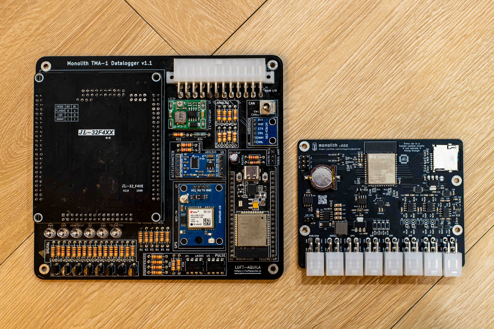
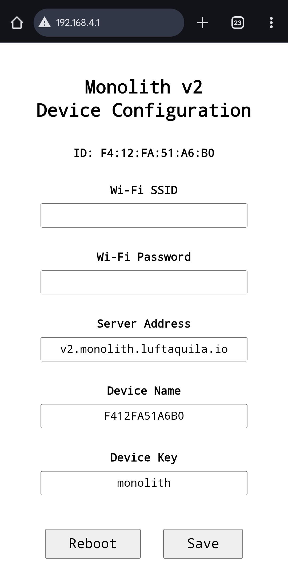
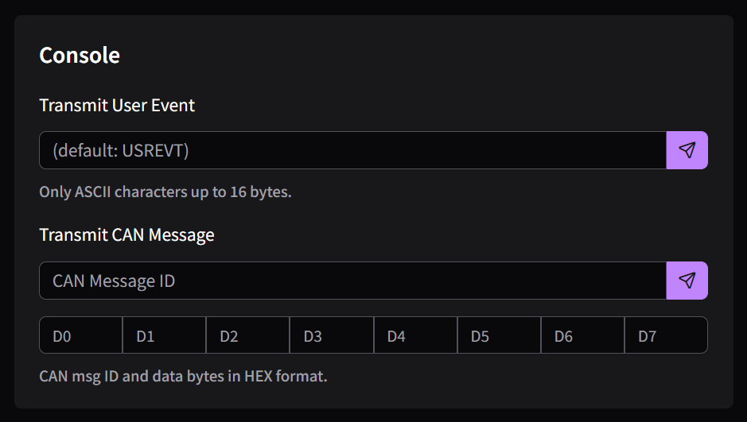
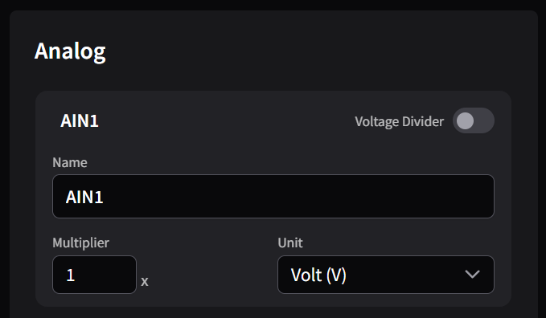
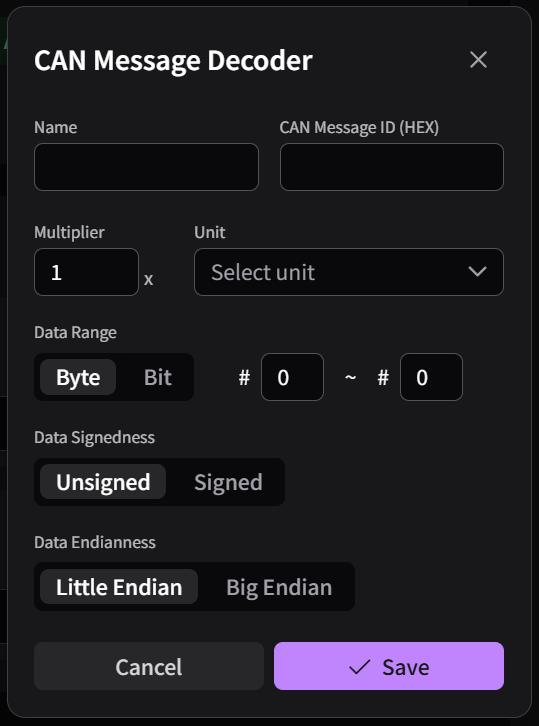
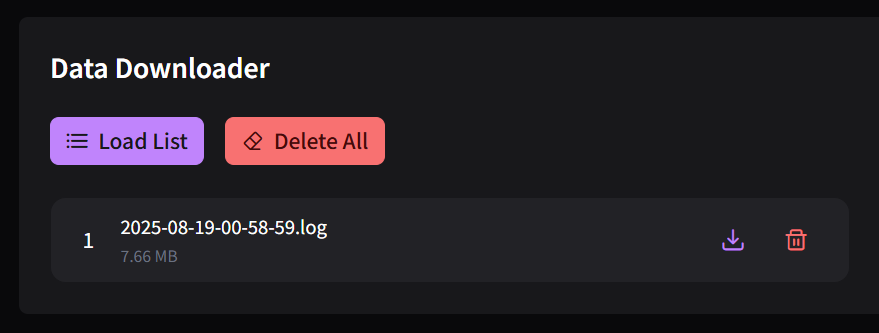

# Monolith v2


## Overview

Monolith is a wireless data logger platform with logger hardware (a.k.a. TMA-1) and a web-based Control Hub.

The project's inspiration was to help students (me 3 years ago) participating in Formula Student and Baja easily collect data from their cars, but it can be used in any other applications, or just as an ESP32-S3 development board.

This is an open-(source & hardware) project, licensed under the 🍺[Beerware License](https://spdx.org/licenses/Beerware.html) for all non-commercial use. You can find more details on the [GitHub](https://github.com/CreatOurCar/monolith).

### Features

📡 Full wireless support

* Real-time telemetry
* Download recorded data
* Transmit User Events
* Transmit CAN messages
* Configure the device (e.g., CAN bit rate)

📀 Up to 100 Hz data rate across various signals

* 1x CAN 2.0(A/B)
* 1x External GPS
* 1x Internal 6-axis accelerometer & gyroscope
* 4x Digital input channels<sup>1</sup>
* 6x Analog input channels<sup>1</sup>
* 1x Power supply voltage sensor
* 1x Chip temperature sensor

<sup>1</sup> Not supported on mini version.

💡 Customizable web-based data analysis tool

All wireless features require a Wi-Fi connection to the Internet.

Q. But where to get it on the car?\
A. Bring a phone with Wi-Fi hotspot on board!
It will also make you available to blame the driver by calling them while driving.

### Preview

#### Compare with v1



* Size and build cost reduced to about 1/3.
* Better performance and telemetry stability.
* Wireless data download & configuration.
* Remote user event & CAN message transmit.

#### Original vs mini

The Mini version is nearly half the size of the Original, with a footprint even smaller than a credit card.

To achieve this, the digital and analog input channels have been removed. However, all other functionalities remain identical.

## Do It Yourself!

### Upload Firmware

1. Prepare a 3.3V UART to USB converter.
    * ⚠️ The converter **MUST** have both `DTR` and `RTS` in addition to `RX` and `TX`.
    * ⚠️ Do **NOT** use a converter with 5V output unless it has a 3.3V voltage selector.
1. Solder a 2x3 2.54mm pin header to the board's UART connector.
1. Connect each pin with the following pinout:
    * `3V3`, `GND`, `DTR`, `RTS`: corresponding pins on the converter.
    * `RX`, `TX`: cross-connect with the converter (`RX` ↔ `TX`).
1. Download and unzip `monolith-{version}.zip` from the [Release](https://github.com/CreatOurCar/monolith/releases/latest).
1. Run `flash.sh` (Linux/macOS) or `flash.bat` (Windows).
    * `python` is required to execute.

### Prepare Server

The TMA-1 and the Control Hub need an MQTT server (broker) to communicate.

We self-host the broker on our local network. Follow the guide below to deploy your own.

<details>

<summary>I want to set up the server on my own.</summary>

<h4>Deploy (Optional)</h4>

If you want to stay away from me, use a commercial MQTT broker service or deploy your own server by following the guide below.

Here, I'll assume you have experience with server things. (DNS records, firewalls, etc.).

***Prerequisites***: A Linux machine with [Docker Engine](https://docs.docker.com/engine/install/) and [Node.js](https://nodejs.org/en/download).
Don't have one? Go get [one](https://www.oracle.com/cloud/free/).

It is *theoretically* possible to run with Docker Desktop and a Windows machine, but I haven't tried it.

Run the commands below, and don't forget to replace `<YOUR_CHANNEL_NAME>` with a cool name.

```sh
sudo apt install -y mosquitto
git clone https://github.com/CreatOurCar/monolith.git

cd monolith/web
npm install
npm run build

cd ../server/config
# set your channel key as the password
mosquitto_passwd -c mosquitto.passwd <YOUR_CHANNEL_NAME>

cd ..
cp .env.example .env
vi .env # set `ACME_EMAIL` and `DOMAIN_NAME` to your own

sudo docker compose up -d
```

##### Server Announcement

Set the `ANNOUNCEMENT` environment variable in the `.env` file to display a notice popup when users open the Control Hub.

```sh
ANNOUNCEMENT=Scheduled maintenance: 2025-01-15 02:00 ~ 04:00 (UTC)
```

</details>

## Usage

### Device (TMA-1)

#### Wi-Fi

TMA-1 requires a 2.4GHz Wi-Fi connection to provide wireless features such as live telemetry and remote record downloads.

However, the data logging function works without Wi-Fi.
To use it offline, remove the SD card and mount it on your computer after driving.

TMA-1 automatically sets its internal clock via SNTP, so you must connect it to the Internet at least once for time synchronization.

##### Initial Setup

1. Power up the device.
1. On first boot, it creates its own Wi-Fi access point (AP) named `Monolith v2 XXXXXX`. Password is `monolith`.
1. Connect to that AP. The setup page will automatically open in your browser. If it doesn't, navigate to [http://192.168.4.1](http://192.168.4.1) manually.\
    
1. Set `Wi-Fi SSID` and `Wi-Fi Password` to the phone's Wi-Fi Hotspot that TMA-1 will connect to while driving (the phone that the driver will bring onboard).
1. Set `Server Address` to your server.
1. Set `Device Name` and `Device Key` to match your server's channel name and key.
1. Click `Save`, then click `Reboot`.

TMA-1 will try to connect to the configured Wi-Fi network after rebooting.

##### Reset

To reset the Wi-Fi and server configuration, hold the reset button for 3 seconds and release.
This restores Wi-Fi, server, device name/key, and all configuration data to factory defaults.

After reset, proceed to the `Initial Setup` step above.

### Control Hub

Control Hub is the web app served from your own server (see `Prepare Server` above).

#### Live Telemetry

Before using Live Telemetry, set the server information in the `Device Configuration` tab.

Also, to view the incoming CAN data, you need to set the CAN Decoders in the `UI Configuration` tab first.

Once the server is configured correctly and the TMA-1 is online, there is nothing else to do here. Everything will work like magic.

The GPS card shows live position data with a `Fix` / `No Fix` tag indicating satellite lock status. You can switch the trail visualization between `Speed` mode (green=slow, red=fast) and `Time` mode (indigo=old, green=recent).

##### Console

You can send a user event or a CAN message to the device.



* User Events
    * A user event marks some meaningful points that can help with later data review.
    * To send a user event, fill in the event name and click the send button.
    * If the event name is empty, it will be recorded as `USREVT`.
    * Only ASCII characters up to 16 bytes are allowed.

* CAN message
    * Enter the CAN message ID (11/29 bits) and the data bytes to send.
    * Click the send button. `0x00` will be sent for the empty data byte fields.

#### Data Viewer

To review your drive, you need to download the recorded data first.
Refer to the `Data Downloader` section in the `Device Configuration` tab to download data.

* Click `Select` and open a `*.log` file that you've downloaded.
* In the `Graph` card, toggle the input category button or the signal name of the legend to see the graph.
* The `GPS` card displays the vehicle's trajectory with a color gradient trail. Switch between `Speed` (green=slow, red=fast) and `Time` (indigo=old, green=recent) modes. Use the slider to scrub through the data and view position, speed, and heading at any point.
* The `CAN` card displays statistics for all recorded CAN messages: message ID, total count, average interval (Hz / ms), DLC, and last data bytes.

To view the recorded CAN data, set the CAN Decoders in the `UI Configuration` tab first.

#### UI Configuration

You can adjust the visibility of the cards in the Live Telemetry and the Data Viewer.
Also, you can set the input signal's name, unit and value multipliers.

Refresh the page for the changes to take effect.

##### Import/Export

Export/import the current UI configuration across devices/browsers.

##### Display

Control the visibility of the cards in each view.

##### Units

Manage custom units that can be used for analog and CAN data.

##### Digital

This section enables you to change the channel name. (e.g., `RUINED IF ON` instead of `DIN1`)

##### Analog



* `Name`: The name shown on the graphs.
* `Voltage Divider`: Turn on if the channel's input is divided by half.
* `Multiplier`: The number multiplied to the measured voltage. Edit it if you have:
    * Another voltage divider circuit for the sensor.
    * A formula to calculate the original physical value.
* `Unit`: An appropriate unit of the value. Add one at the `Units` card if you don't have it.

##### CAN

Manage CAN message decoders. A decoder extracts useful data from the CAN message bytes.



* `Name`: The name shown on the graphs.
* `CAN Message ID`: The message ID that desired data is included.
* `Multiplier`: The number multiplied to the original value.
* `Offset`: The number added after multiplication. Final value is `multiplier × original + offset`. Default is `0`.
* `Unit`: The data unit that added on the `Units` card.
* `Data Range`: The part of the CAN payload that contains the data.
    * The CAN payload has a maximum length of 8 bytes.
        * `Byte` mode: The possible range is #0 to #7.
        * `Bit` mode: The possible range is #0 to #63.
        * To select a single byte/bit, set the start and end range to the same value.
* `Data Signedness`
    * `Unsigned`: Decode the data as an unsigned value.
    * `Signed`: Decode the data as a 2's complement value.
* `Data Endianness`
    * Only available in `Byte` mode.
    * Defines the endianness of multi-byte data.
* `Data Filter` / `Data Mask` (optional): Hex values to filter CAN messages by payload content. Only messages where `(data & mask) == filter` are decoded. Both must be specified together or left empty.

#### Device Configuration

This section configures the server for the Control Hub and the device peripherals.

The configurations will be automatically loaded if the device is online.

##### Server

* `Address`: The server for the Control Hub.
* `Name` / `Key`: Channel name and key.

All values must match the values configured to the device during the `Device - Initial Setup` sequence.

The server will be automatically connected after you click the save button.

##### Device

* `SSID` / `Password`: The Wi-Fi network that the device will connect to.
* `Timezone`: The POSIX timezone string for your location. Use the [converter](https://phpsecu.re/tz/)'s `TZ_INFO` value.
    * It is used to determine the log file name's time. Recorded logs use the UTC time, so it won't be affected.
* `T. Interval`: The interval at which the device transmits telemetry.

##### Inputs

Controls whether the digital/analog input channels are logged or not.

##### CAN

* `Enabled`: Whether the CAN bus is logged or not.
* `Bit rate`: The bus baud rate.
* `Filter`: The expected message ID (11/29 bits)
* `Mask`: The filtering rule for each bit of the filter.
    * `0`: The corresponding filter bit must match to pass.
    * `1`: The corresponding filter bit is ignored (don't care).

Refer to the *Acceptance Filter* section of the [ESP32-S3 API Reference](https://docs.espressif.com/projects/esp-idf/en/v6.0.1/esp32s3/api-reference/peripherals/twai.html#acceptance-filter) for the detailed explanation of the `Filter` and `Mask`. All CAN messages will be accepted by default.

##### GPS

* `Enabled`: Whether the GPS location is logged or not.
* `Device`: Select the device type. Only `UBLOX` is currently supported.

##### [Danger Zone](https://www.youtube.com/watch?v=siwpn14IE7E)

* `Refresh`: Loads the device's configuration.
    * All changed configurations require a device restart to be applied.
    * If you refresh before restarting, the previous value will be loaded.
* `Restart`: Restart the device.
* `Reset`: Reset the device.

##### Data Downloader



* `Load List`: Lists all recorded log files except the current boot session.
* `Delete All`: Deletes all recorded log files except the current boot session.

After loading the file list, click the download button to download a specific file.

## Development

This section is for computer-guys who wants to modify the software on their own.

<details>

<summary>Open the magic</summary>

<h3>Firmware</h3>

1. Star the [GitHub repository](https://github.com/CreatOurCar/monolith).
1. Install [ESP-IDF](https://docs.espressif.com/projects/esp-idf/en/stable/esp32s3/get-started/index.html) And run the following commands.

```
git clone https://github.com/CreatOurCar/monolith.git
cd monolith/device/firmware
make build
make run   # build & flash
```

<h3>Control Hub</h3>

1. Star the [GitHub repository](https://github.com/CreatOurCar/monolith).
1. Run the following commands:

```
git clone https://github.com/CreatOurCar/monolith.git
cd monolith/web
npm install
npm run vite
npm run build
```

</details>